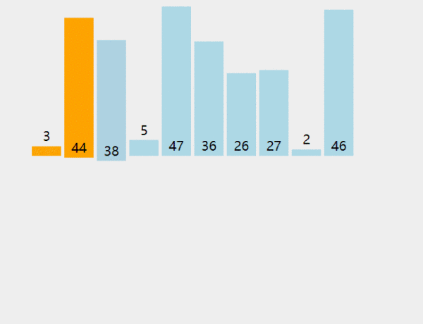

### [中文文档](https://github.com/sherlonWang/gifplayer)|[English Document](https://github.com/sherlonWang/gifplayer/blob/master/README_EN.md)

# GIF图片播放/暂停

> 本项目参考自Rubén Torres的Gifplayer项目<https://github.com/rubentd/gifplayer>

### 1.介绍

#### 我们在浏览一些具有逻辑性的GIF动图时，往往希望GIF可以暂停，留下我们思考的时间。不然就会出现如下情景：


#### 卧槽！等等！慢点啊！还没想明白上一步在干嘛呢！是不是比较崩溃？这时候如果可以随时控制GIF暂停播放，是不是就爽多了，比如下面这样：


#### 有人可能会问，直接用视频格式不就行了吗？确实，用视频肯定行，但是有些步骤本来就比较少，用视频就有点杀鸡用牛刀的感觉了...

### 2.使用

#### 引入css文件

```html
<link href="css/gifplayer.min.css" rel="stylesheet" />
```

#### 引入js文件

```html
<script src="js/gifplayer.min.js" type="text/javascript"></script>
```

#### 使用GIF图片

#### 使用img标签，GIF路径写到data-src属性中。

```html

```

#### <font color = red>注：文件路径视自己实际项目路径而定</font>

### 3.显示效果

#### GIF图片处理后，会在图片中上方显示一个暂停\播放图标，可以点击该图标实现GIF的暂停与播放。效果如下：


#### 希望对你有点帮助哦！